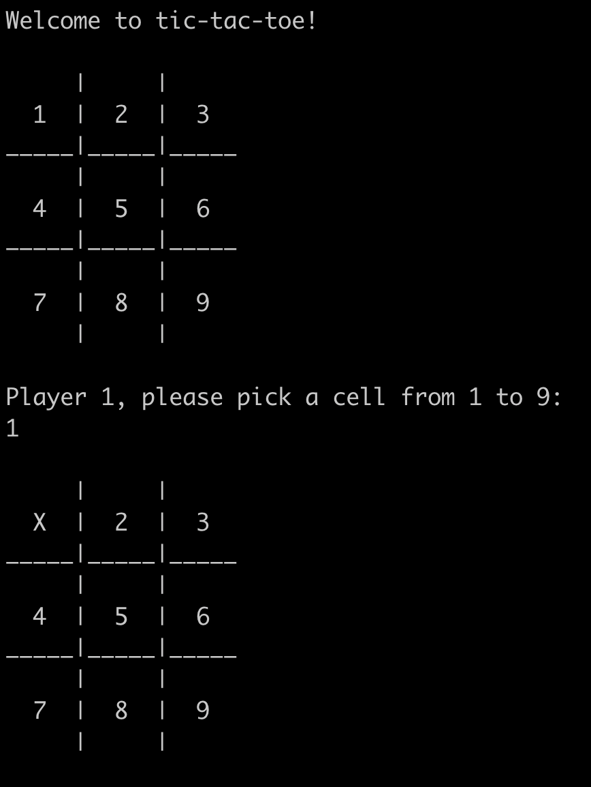

# Tic-Tac-Toe 

This project is a recreation of the game tic-tac-toe in Java that can be run in the terminal.

This project has been designed with OOP principles, with great focus being applied to SRP from SOLID.

Upon loading the game, the players will be met with an interface that displays the board with each cell numbered 1-9. The two players will alternate turns where they must enter a number from 1-9 in the terminal in order to put X or O in a cell of their choosing. Once a player has won or the game has ended in a draw, the interface will ask the players if they would like to play again or exit the program.

<p align="center">
  
</p>

<p align="center">
  <b>Fig.1 -</b> Some example output from the program. Initially, the game starts with a welcome message before asking the player to choose a cell. The player then chooses cell number 1, which updates the board by placing X in the topleft cell.
</p>

## Getting Started

Start by cloning this repository using

```
git clone https://github.com/jmcnally17/tictactoe-java.git
```

If you want to compile the code yourself, you will need to install the Java Development Kit (JDK), which can be installed via Homebrew and then linked by running

```
brew install java
sudo ln -sfn /usr/local/opt/openjdk/libexec/openjdk.jdk /Library/Java/JavaVirtualMachines/openjdk.jdk
```

Then navigate to the [bin](https://github.com/jmcnally17/tictactoe-java/tree/main/bin) folder and enter

```
javac ../src/*.java -d .
```

which creates the .class files (you can try deleting these files first to verify the compiling worked)

## How To Run

While in the [bin](https://github.com/jmcnally17/tictactoe-java/tree/main/bin) folder, run

```
java TicTacToe
```

and the game should run in your terminal.
